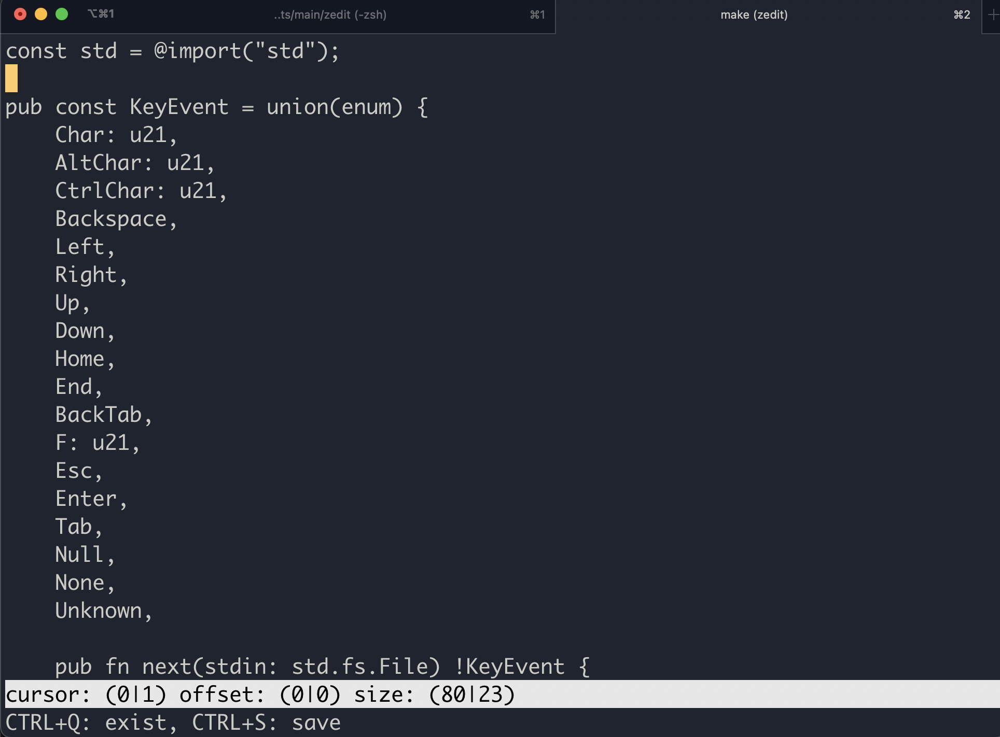

# ZEDIT

This is my attempt of rewrite [RTE](https://github.com/Harzu/rte/tree/master) to zig



Make help output
```
help                 List all available targets with help
build                Build binary file
run                  Run without file
run_with_file        Run big file
run_with_empty_file  Run empty file
```
